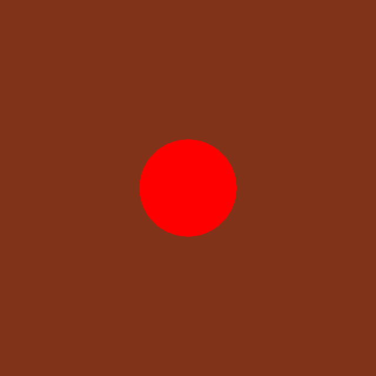
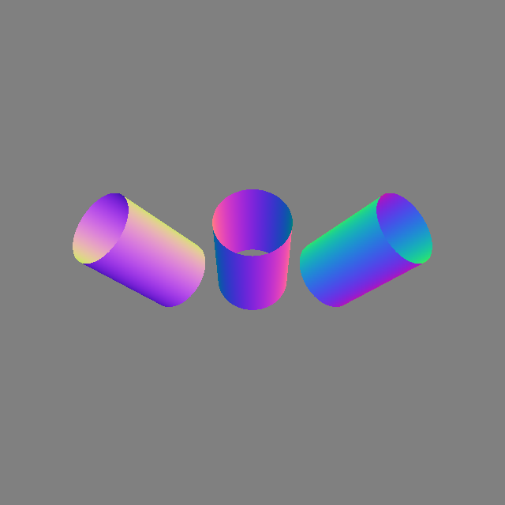
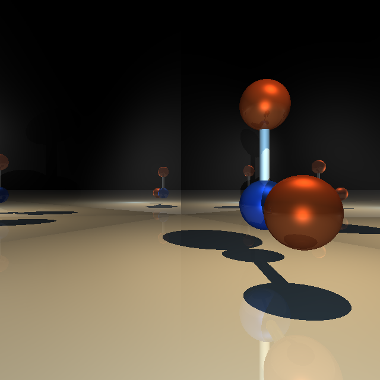
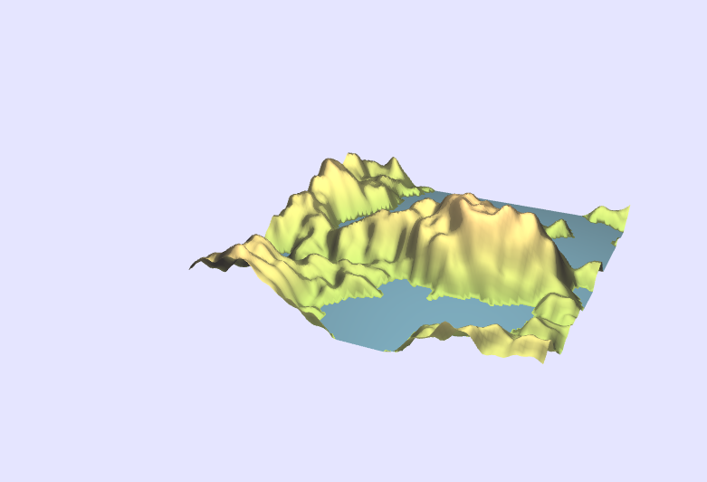
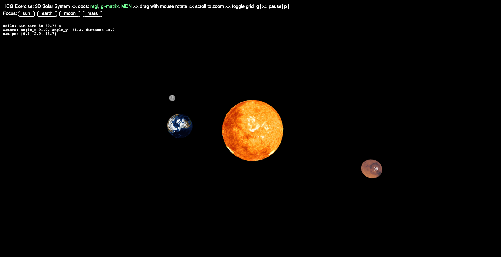
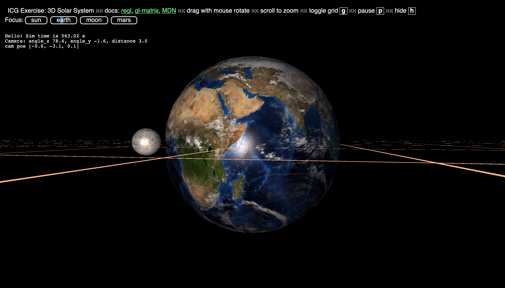
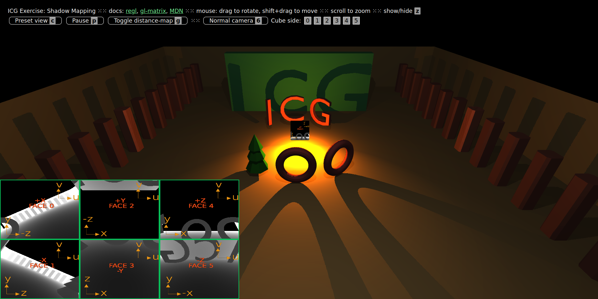

# Computer graphics labs and project

This repo regroups all the lab and the final project developed for the EPFL course CS-341 Computer graphics.

Any of the labs / project can be accessed by running a local server with the following line. 

```
$ python3 -m http.server
```

It should be executed in the folder containing the lab / project. Then you should be able to view it by open your [localhost](http://localhost:8000/index.html) in your favorite browser.

## Labs

* [Lab 0 - “Hello World”](./icg_exercise_0):  
  We set up the work environment. The above instructions are eplained more in details in this lab.
* [Lab 1 - Planes and Cylinders](./icg_exercise_1):  
  We compute ray intersection with various 3D shapes (plan, cylinder).
* [Lab 2 - Lighting](./icg_exercise_2):  
  We implement the lighting in the scene in three steps: phong lightiing, shadows and reflections.
* [Lab 3 - Raytracing Meshes](./icg_exercise_3):  
  We add support for triangle based meshes. We look at flat vs phong shading and make the computation more efficient using bounding box.
* [Lab 4 - Geometric transforms in the GPU pipeline](./icg_exercise_4):  
  We change the pipeline from ray tracing to rasterization to take advantage of the GPU. We render of the solar system with this new pipeline.
* [Lab 5 – Texturing and Lighting](./icg_exercise_5):  
  We improve to look of the solar system by implement the phong lighting model and adding textures.
* [Lab 6 - Shadows and Cube Mapping](./icg_exercise_6):  
  We create shadows using shadow maps. In a 3D scene, six shadow maps are computed per light source in a cube face fashion.
* [Lab 7 - Perlin Noise, Procedural Terrain](./icg_exercise_7):  
  We implement 1D and 2D noise functions, then use them to generate textures and terrain.

Here is one image per lab to sum up the work effectued through the labs:

     
   
