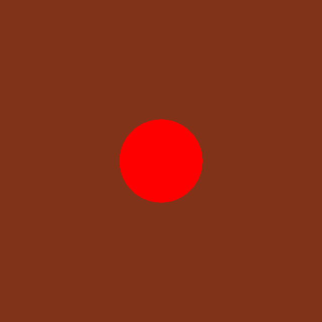

# ICG Exercise 0 - Raytracing "Hello World" - Handout

[Handout](https://htmlpreview.github.io/?https://github.com/jonasblanc/ComputerGraphicProject/blob/master/icg_exercise0/exercise0.html)

The goal of the first exercise is to set up the environment we will work with for the next labs.

Once everything is set up correctly, here is the final result:

