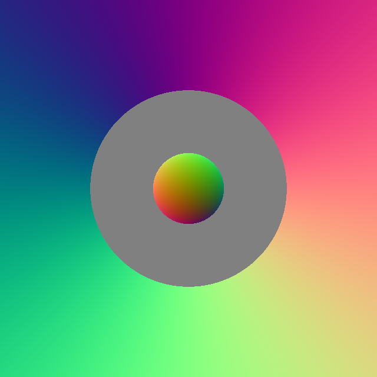
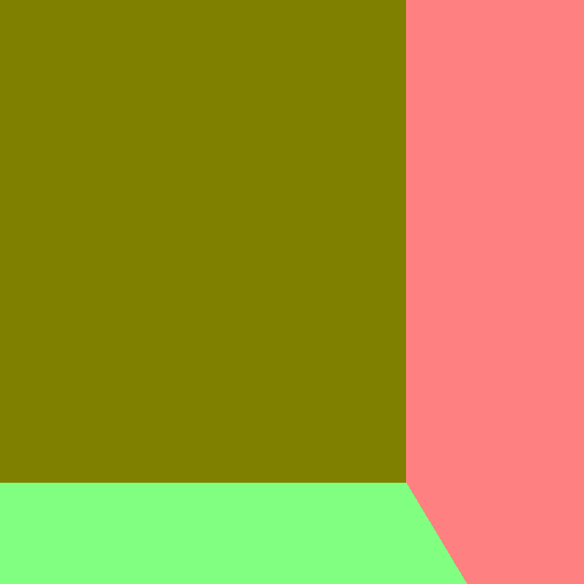

# ICG Exercise 1 - Planes and Cylinders

[Handout](https://htmlpreview.github.io/?https://github.com/jonasblanc/ComputerGraphicProject/blob/master/icg_exercise_1/exercise1.html)

The goal of this exercise is to compute the intersection between rays from the camera eye and the different objects in the scene. We compute the intersection point and the surface normal at this point. In this lab we implement the pipeline for plan and cylinder intersection.

[Here](./report/Theory.pdf) is the mathematical derivation for the cylinder intersection.  
[Here](./report/README.md) is a summary of the executed tasks in this lab.

Here are some images of the scenes that we can render with the current version of the pipeline. The framework is configured to visualize the surface normals in false color (the normal XYZ components in [-1, 1] are mapped linearly to RGB values in [0, 1])

  
