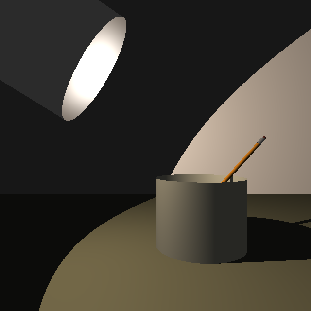
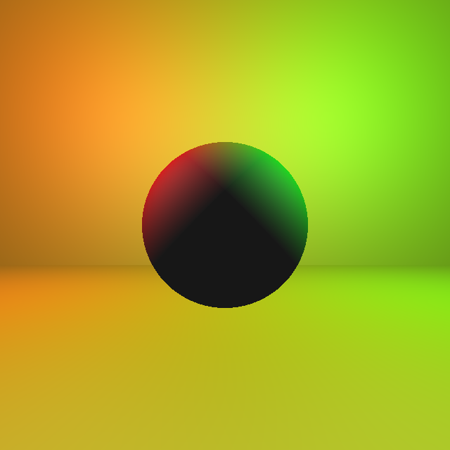
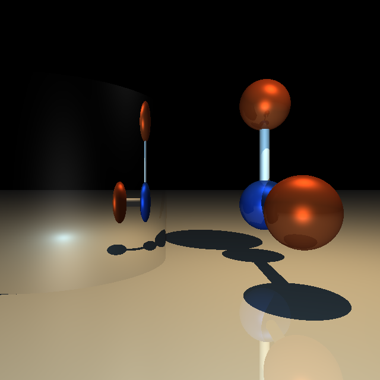

# ICG Exercise 2 - Lighting
[Handout](https://htmlpreview.github.io/?https://github.com/jonasblanc/ComputerGraphicProject/blob/master/icg_exercise_2/exercise2.html)

In this exercise we bring light into the scenes by first implementing the phong lighting model, then computing the shadows and finally adding differnts level of reflexion.

[Here](./report/Theory.pdf) is the mathematical derivation for the computation of the pixel colors with infinite reflexion.
[Here](./report/README.md) is a summary of the executed tasks in this lab.

Below are some examples of the scene.

With phong lighting and shadows:  

Then we add reflexions:  

