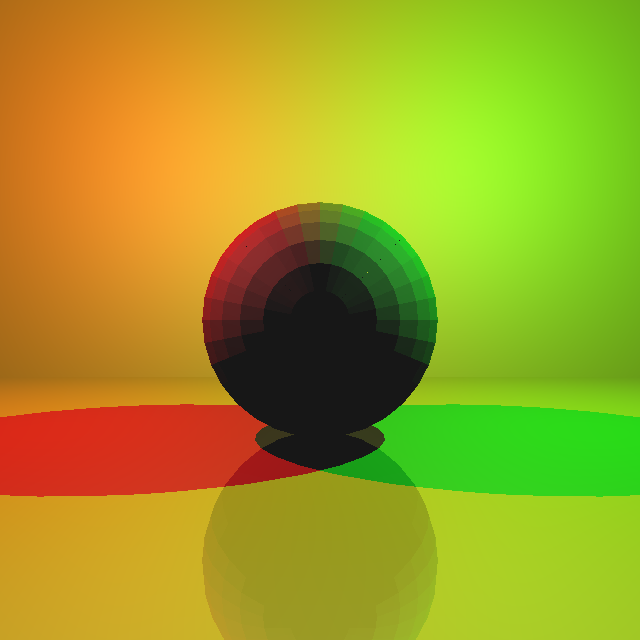
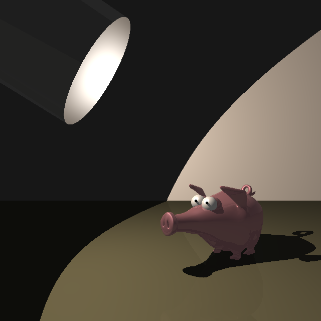
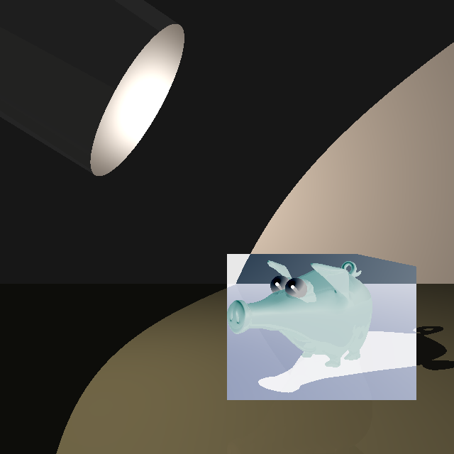

# ICG Exercise 3 - Raytracing Meshes
[Handout](https://htmlpreview.github.io/?https://github.com/jonasblanc/ComputerGraphicProject/blob/master/icg_exercise_3/exercise3.html)

In this exercise we add support for triangle face meshes. We took three steps in that direction. First, we have to find if and where the camera rays intersect the triangle faces. Then compute the surface normal at each intersection point. Finally instead of computing ray-triangle intersection for all triangles in the mesh, we test if the ray intersect certain regions of the scene by creating a bounding box around the meshes.

For the normal computation we implemented two strategies. The first one, named flat shading, is to use the face normal for each intersection point in the face. For the second, named phong shading, we interpolate the normal based on the normals of the faces' vertices.

[Here](./report/README.md) is a summary of the executed tasks in this lab.

Below is a comparison between flat shading and phong shading:  
 

Here we make the bounding box visible by inverting the color inside it:  
 

