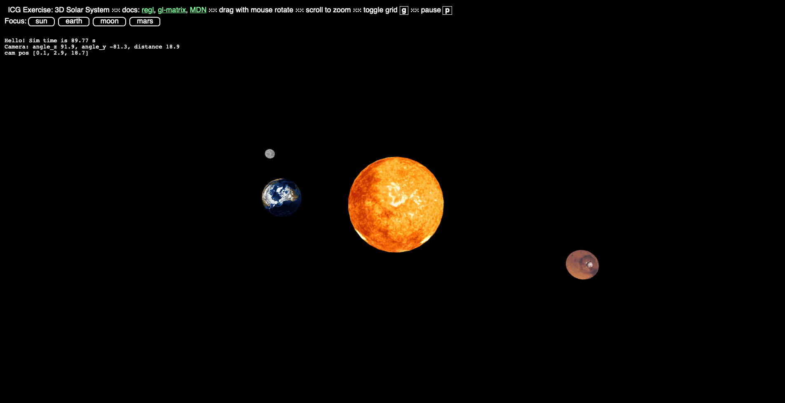

# ICG Exercise 4 - Geometric transforms in the GPU pipeline
[Handout](https://htmlpreview.github.io/?https://github.com/jonasblanc/ComputerGraphicProject/blob/master/icg_exercise_4/exercise4.html)

In this exercise, we change the rendering pipeline from the iterative ray tracing model implemented in the previous labs to rasterization to be able to do parallel computing on the GPU. We start getting familiar with geometric transformations by rendering a basic 2D scene. Then move on to a more complex scene representing the solar system with the Sun, the Earth, the Moon and Mars.

[Here](./report/README.md) is a summary of the executed tasks in this lab.

Here are some screenshots from the final scene:

  

