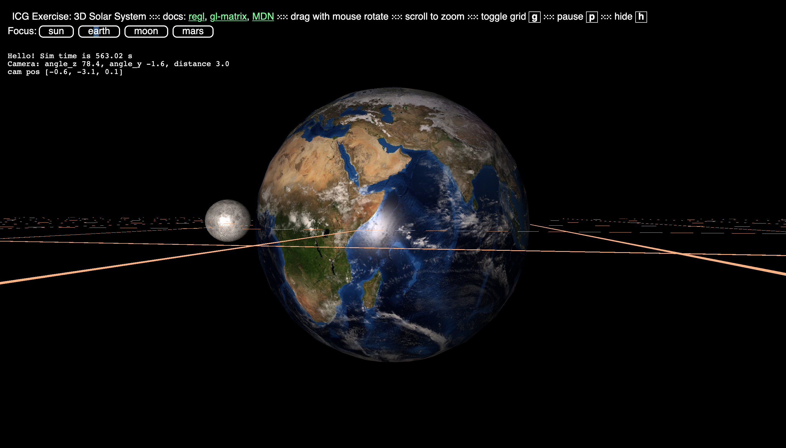

# ICG Exercise 5 – Texturing and Lighting
[Handout](https://htmlpreview.github.io/?https://github.com/jonasblanc/ComputerGraphicProject/blob/master/icg_exercise_5/exercise5.html)

In this exercise we improve the solar sytsem of the previous lab by adding lighting and texture. We first create a halo around the sun by placing a plan perpendicular to the camera cutting the sun in two halves. We decrease the opacity of the plan proportionally to the distance to the center of the sun. Once again we impelement the phong shading model to illuminate the planets. Then we add different textures for the earth for the day and night. Finally we had to add a custom made mesh generated in blender.

[Here](./report/README.md) is a summary of the executed tasks in this lab.

Here are some screenshots from the final scene:

  

