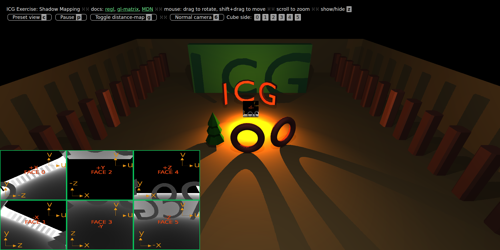

# ICG Exercise 6 – Shadows and Cube Mapping
[Handout](https://htmlpreview.github.io/?https://github.com/jonasblanc/ComputerGraphicProject/blob/master/icg_exercise_6/exercise6.html)

In this exercise we implement shadow trough shadow maps. In a 3D scene, we create a virtual cube around each light source and compute a shadow map for each face of the cube.

[Here](./report/README.md) is a summary of the executed tasks in this lab.

Here are some screenshots from the final scene:

  

In the screenshots below we draw the shadow map for each face of the cube for the central light. 

