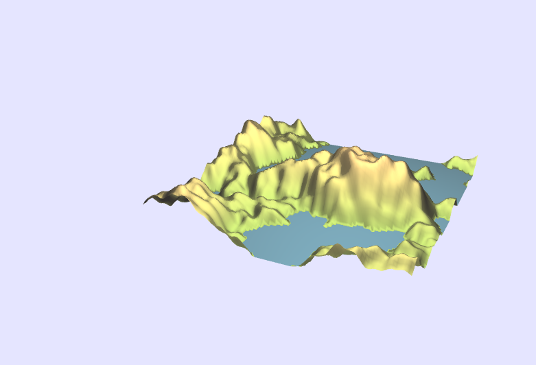

# ICG Exercise 7 - Perlin Noise, Procedural Terrain
[Handout](https://htmlpreview.github.io/?https://github.com/jonasblanc/ComputerGraphicProject/blob/master/icg_exercise_7/exercise7.html)

For this lab there two different index to view the scenes: 
* [Textures](http://localhost:8000/index_textures.html)
* [Terrain](http://localhost:8000/index_terrain.html)

In this exercise we explore perlin noise. First in 1D, we vary the amplitude and frequency and add multiple perlin noise together to form a FBM. Then we implement perlin noise in 2D, use it to display texture and finally create a terrain with height corresponding to the noise value.

[Here](./report/README.md) is a summary of the executed tasks in this lab.

First in one 1D: top 4 plots depict the Perlin noise function at different frequencies. The bottom plot shows the weighted sum of these octaves (fBm).  

Then in 2D. with different textures:  
  

Finally perlin noise generated terrain using height map:  

