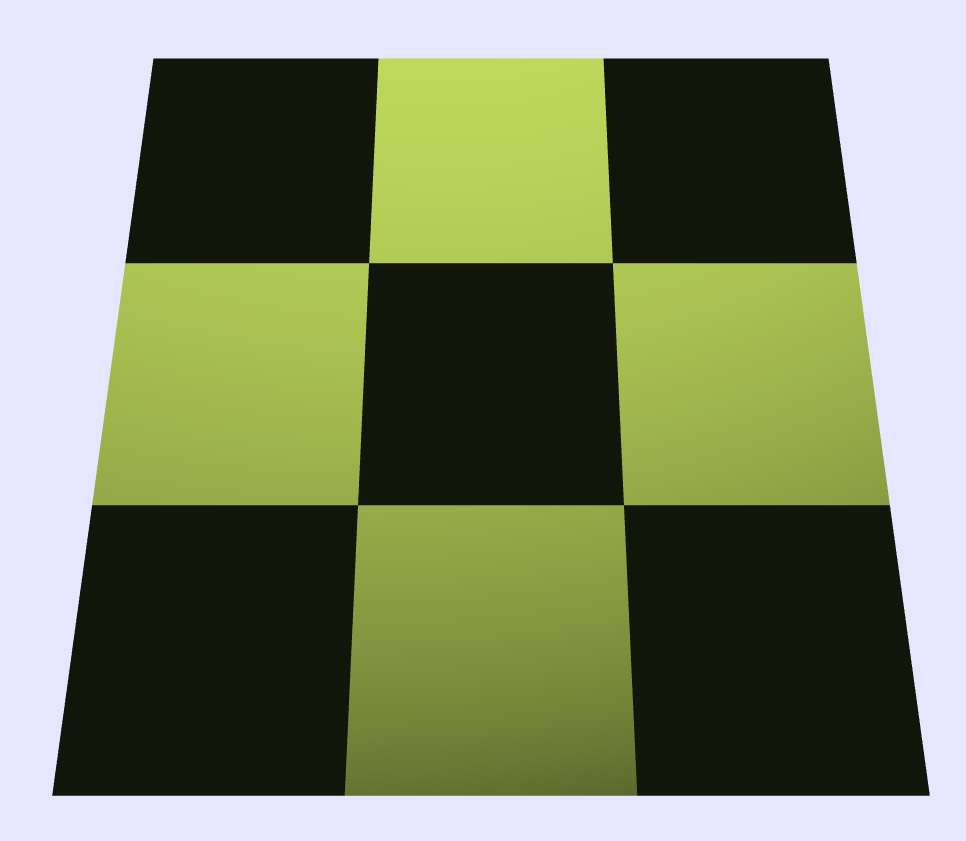
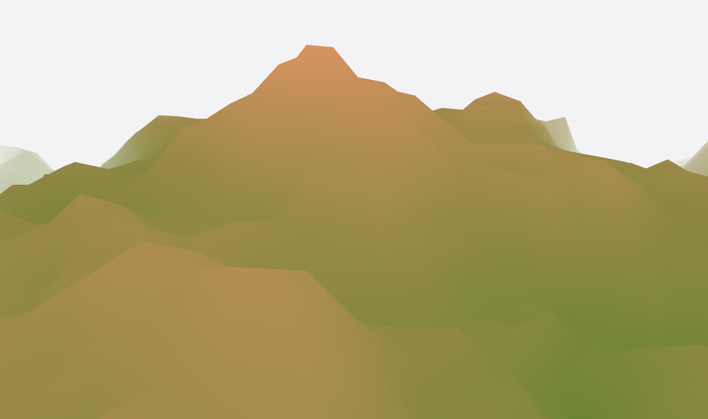
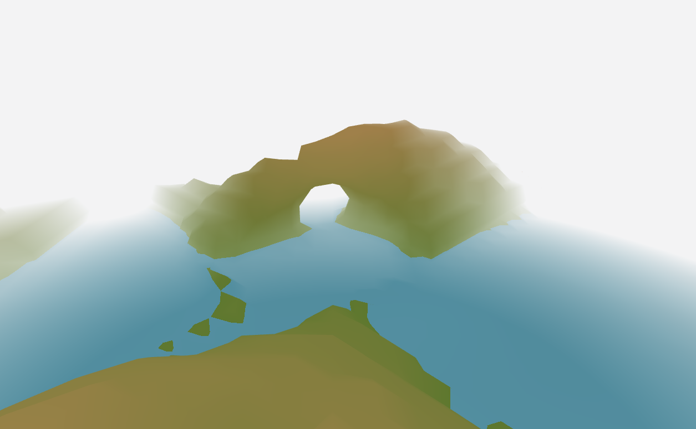
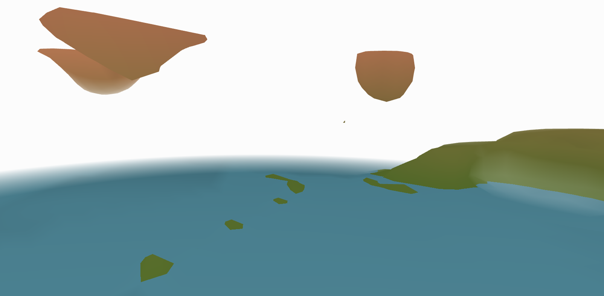
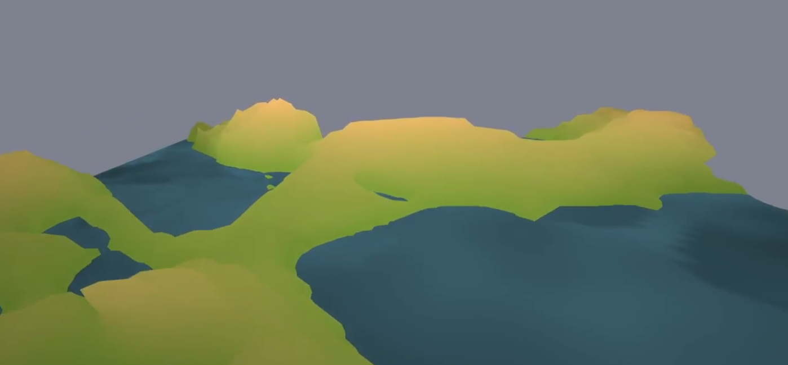
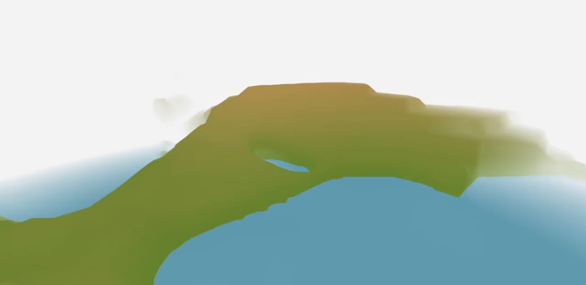
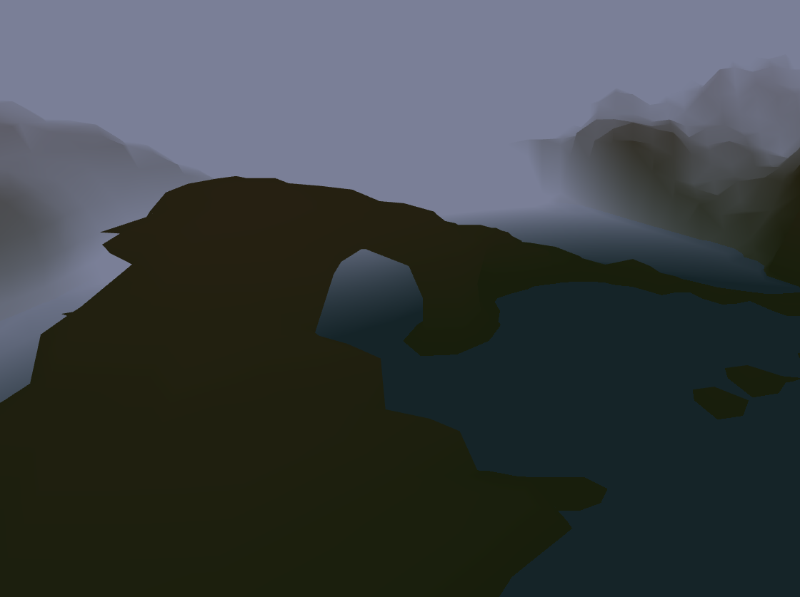
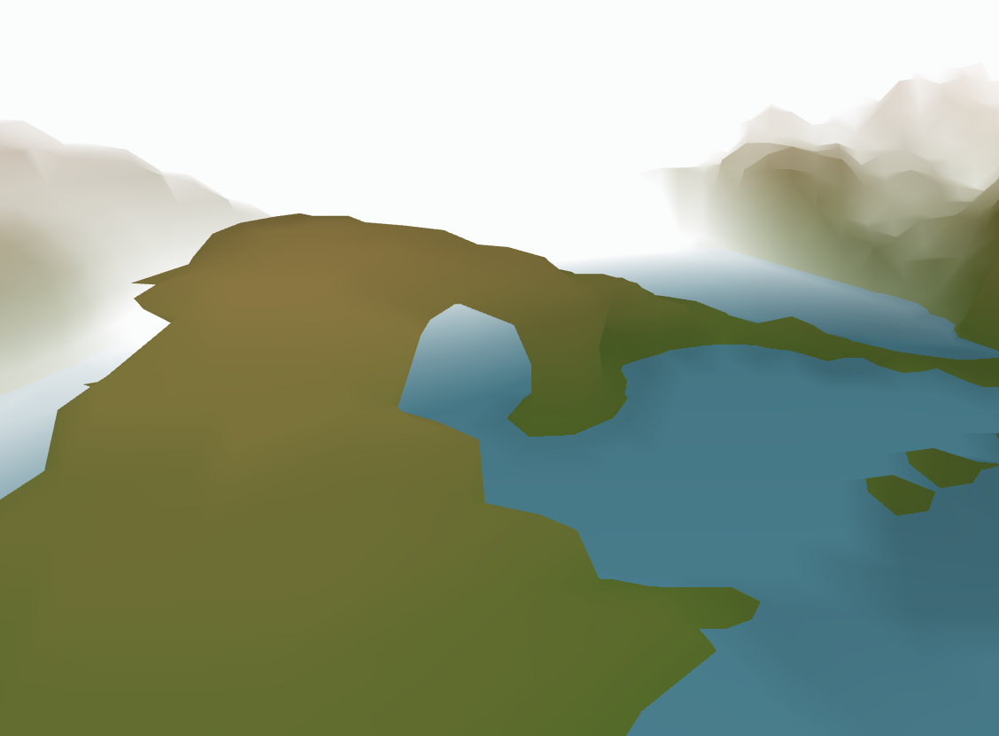
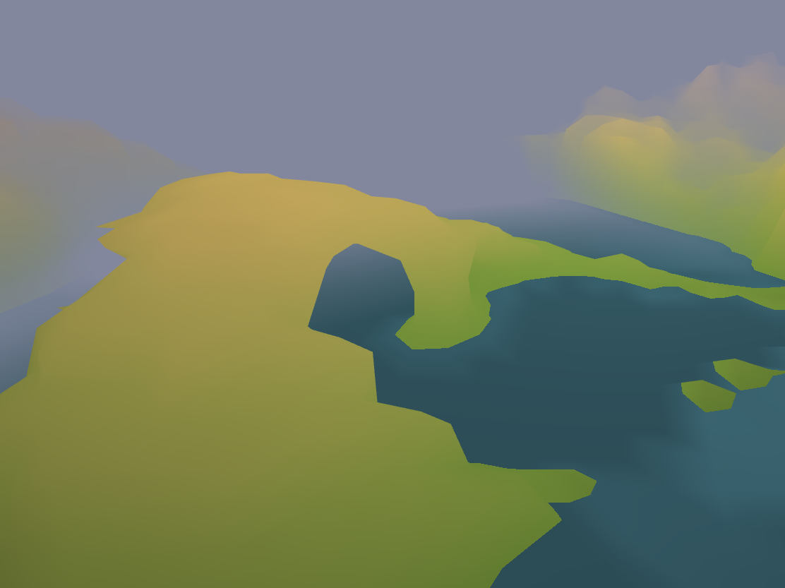
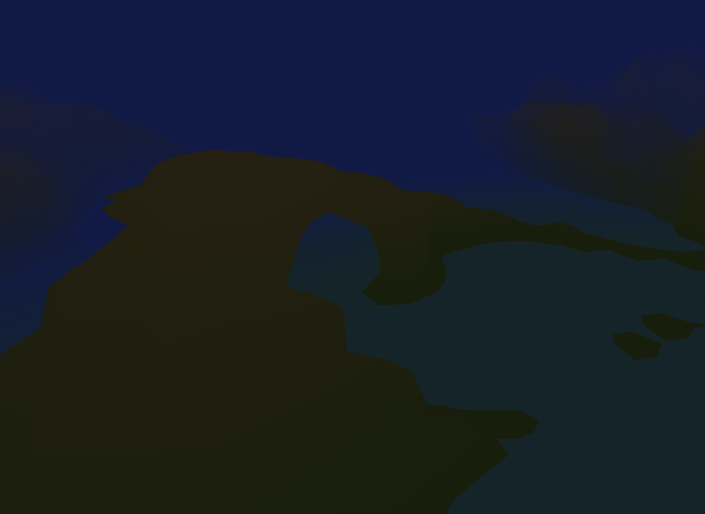

Group 9:  
Zad Abi Fadel  
Loïc Houmard  
Jonas Blanc  

## Abstract
The goal of this project is to generate an infinte map. The implementation relies on the marching cubes algorithm and makes use of multiple three dimensional Perlin Noise functions to make it aesthetically pleasing and look randomly generated. All design choices are made to keep the project computationnally efficient in order to run smoothly on most modern day machines. In addition to that, the GPU, through the shaders, was used to compute the color of each pixel. 

## Technical Approach

### Marching cube algorithm

We implemented a JS version of the marching cube algorithm. We followed [Ben Anderson's paper](https://www.cs.carleton.edu/cs_comps/0405/shape/marching_cubes.html) for the main steps. First we created a version where the vertices are placed on the middle of the edges, then we modified it to interpolate their exact position based one the noise value at the cube corners. We had to adapat our code to integrate the lookup table (used as an efficient way to retrieve cube faces based on the corner noise value) published in [Paul Bourke's paper](http://paulbourke.net/geometry/polygonise/). We used our own design to iterate over cubes and to translate the coordinates for the noise function or to draw the mesh, resulting in quite a fiew index translation.

The pipeline of our implementation is the following:
* Compute the noise value for every cube corners.
* Iterate over every cube which is at the surface of our terrain.
* Read the corresponding faces in the lookup table.
* For every vertex of every face update its position and normal.

For the normal computation, at first we used a weighted average of the faces normal, but it lead to difficulties at chunk boundaries. We finally computed the normal as the gradient of the noise function which resolved the boundary bug and ended up to be much smoother.

### Partial chunk generation

In order to give the impression of infinite terrain, we rely on partial chunk generation. This straightforward yet effective method makes the computational load bearable. Indeed, we partition the rendered area of the map in 9 chunks of given dimensions (10x10x10 for example) to generate our map. Whenever the camera is moving, we delete in memory the 3 chunks that are in the opposite direction of the camera movement and compute the 3 new chunks. Like that, we always have 9 chunks, we don't have too many computation to do and we can move to infinity in each directions.

{width="400px"}

{width="400px"}

- An intuitive interaction with the scene where we can move the camera in the x and y direction, allows us to see the generation of the terrain and see that it is indeed infinite.

### Terrain specialisation
One of our extension was to add different biomes with different features. We chose to have 3 differents terrains: mountains, archipelagos and floating islands. To generate coherent terrains and not just random looking shapes, we decided to do a mix between a 2D perlin-noise function to compute a height and a 3D perlin-noise to modify it and create hollow surfaces. We took our inspiration from this [forum](https://www.gamedev.net/forums/topic/612655-3d-perlin-noise-map-ridges/) but implemented everything by ourselves.

Our implementation works as follows: we first call a 2D noise function and use the value returned to choose between our 3 terrains using predefined thresholds. This way, there would be some continuity in the kind of terrains generated, but it will still be random and allow different terrain types to be mixed together. Then, we call the corresponding biome noise function which returns the value for the 3D coordinate used in the marching cube. The terrain noise functions are implemented using 2D perlin noise FBM with thuned parameters mixed with a 3D perlin noise. In order to have smooth surfaces with the marching cube algorithm, and to be able to compute the normals as the gradient of a signed distance function, they return the difference between the z axis and the height given by the 2D perlin FBM.

Our 3 terrains work as following:

#### Mountains

{width="600px"}

Mountains are charachterised by higher average altitude and sharper peaks. We decided not to let mountains having holes, therefore, this terrain doesn't use our 3D perlin-noise (thus could be rendered with a height map based algorithm instead of the marching cube). In order to have a higher altitude, we added a base height to our 2D noise function for the height. In order to add sharper peaks, we used many octaves and a quite high amplitude multiplier factor in our 2D perlin FBM.

#### Archipelagos

{width="600px"}

Archipelagos are charachterised by more continuous height differences without any peaks and can have holes to create sort of bridges. To avoid having peaks, we used only 1 octave in our 2D perlin FBM for the height. Then to create holes and use the full power of the marching-cube algorithm, if z is smaller than the height (i.e. we would be "inside the terrain"), we use our 3D perlin FBM function with tweeked paramters. This will potentially create holes by returnng values interpreted as "outside the terrain" even if we are under the height computed with the 2D FBM.

#### Floating Islands

{width="600px"}

Floating islands are flying on top of water. Basically, we used a max and min threshold where we are for sure outside the surface. Then, we use our 3D perlin FBM with parameters that most of the time return a value interpreted as outside the surface and just sometimes as inside the surface, which will create blocks of earth on top of the water.

### Mist

{width="500px"}

{width="500px"}

The partial chunk generation has it's shortcomings. The main one being the fact that you can clearly see the linear disparity between the end of the generated area and the background. In order to fix that problem, we could have generated more chunks, increased chunk dimensions or even zoomed in. Instead, we implemented a mist feature to work around that problem. For all generated points that are further than a certain threshold, we mix their color with the color of the sky. The quantity of the sky color in that mixture is linearly dependent on the distance to the aforementionned threshold. We judged it to be the best solution computation-cost wise and aesthetically-wise

### Day-Night Cycle

{width="400px"}

{width="400px"}

{width="400px"}

{width="400px"}

We also implemented a day-night cycle. We keep track of the time and use it to compute the color of the background/sky. This color is always a mixture between a pre-defined day color and a pre-defined night color. We move the light source accordingly to give a realistic effect.

### Difficulties and challenges

Here are some difficulties and challenges we faced:

- We had some struggles knowing how to start the project as we had to familiarise ourselves with the whole pipeline. As soon as we understood what should be executed on the GPU or on the JS side, it went way better.
- An error occurred in one of our many index changes which created discontinuity between chunks. It took us a while to find the source of the problem.
- The implementation of the marching cube algorithm required a lot of reflection on the representation of the data and on how to iterate on our different entities. It took us a few coding sessions to get comfortable with the different coordinates and index systems.
- As explained above our first normal computation version was not compatible with our chunks implementation so we spent quite some time on that issue before modifying the way normals are computed.

## Results

<video width="600" height="450" controls>
  <source src="Video/video.mp4" type="video/mp4"/>
</video>

## Contribution

Every member participated in almost every tasks and understand the project as a whole. However, we still splitted the work and some members spent more time on some features. These are the features each member worked on a bit more in depth than the others:

Jonas: Marching cube algorithm and infinite map generation  
Zad: Mist effect and day/night cycle  
Loïc: Noise functions and terrain specializations  

## Resources/Inspirations:

* https://www.cs.carleton.edu/cs_comps/0405/shape/marching_cubes.html  
* http://paulbourke.net/geometry/polygonise/  
* https://www.redblobgames.com/maps/terrain-from-noise/  
* https://www.gamedev.net/forums/topic/612655-3d-perlin-noise-map-ridges/  
