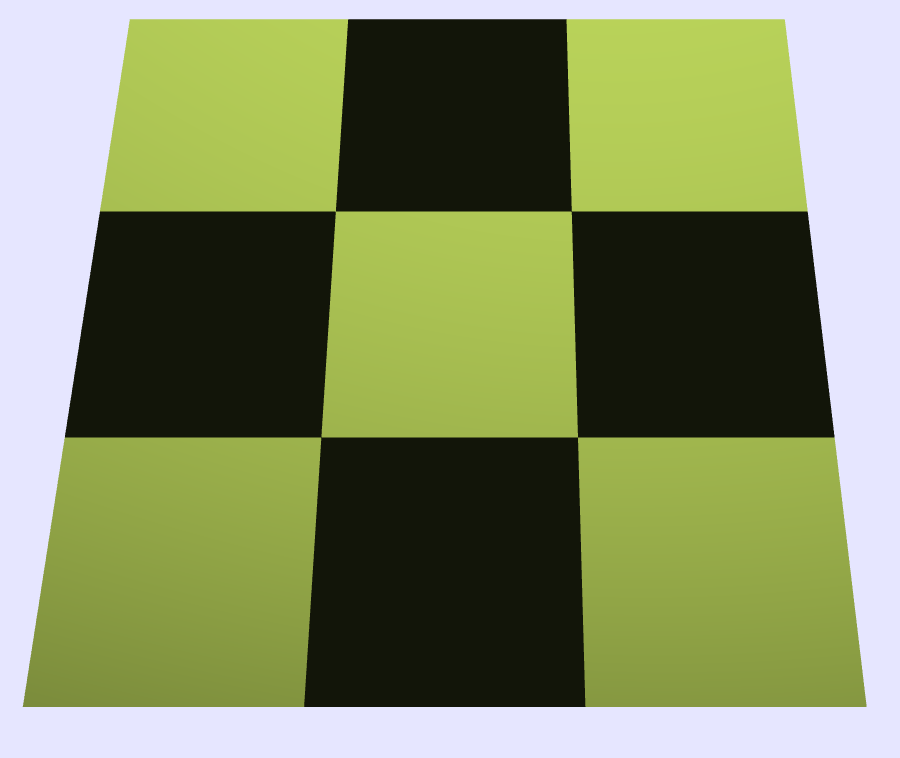

# Project: Infinite map generation

## Abstract
The goal of this project is to generate an infinte map. The implementation relies on the marching cubes algorithm and makes use of multiple three dimensional Perlin Noise functions to make it aesthetically pleasing and make it seem randomly generated. All design choices are made to prioritize the use of the GPU and keep the project computationnally efficient in order to run smoothly on most modern day machines.

## Technical Approach

### Marching cube alorithm

We implemented a JS version of the marching cube alorithm. We followed [Ben Anderson's paper](https://www.cs.carleton.edu/cs_comps/0405/shape/marching_cubes.html) for the main steps. First we created a version where the vertices are placed on the middle of the edges, then we modified it to interpolate their exact position based one the noise value at the cube corners. We had to adapat our code to integrate the lookup table (used as an efficient way to retrieve cube faces based on the corner noise function) publied in [Paul Bourke's paper](http://paulbourke.net/geometry/polygonise/). We used our own design to iterate over cubes and to translate the coordinates for the noise function or to draw the mesh, resulting in quite a fiew index translation.

### Partial chunk generation

In order to give the impression of infinite terrain, we rely on partial chunk generation. This straightforward yet effective method makes the computational load bearable. Indeed, we partition the rendered area of the map in 9 chunks of given dimensions (10x10x10 for example) to generate our map. Whenever the camera is moving, we delete in memory the 3 chunks that are in the opposite direction of the camera movement and compute the 3 new chunks. Like that, we always have 9 chunks, we don't have too many computation to do and we can move to infinity in each directions.

- An easy interaction with the scene where we can move the camera in the x and y direction, allows us to see the generation of the terrain and see that it is indeed infinite.

### Mist
The partial chunk generation has it's shortcomings. The main one being the fact that you can clearly see the linear disparity between the end of the generated area and the background. We implemented a mist feature to work around that problem. For all generated points that are further than a certain threshold, we mix their color with the color of the sky. The quantity of the sky color in that mixture is linearly dependent on the distance to the aforementionned threshold.

