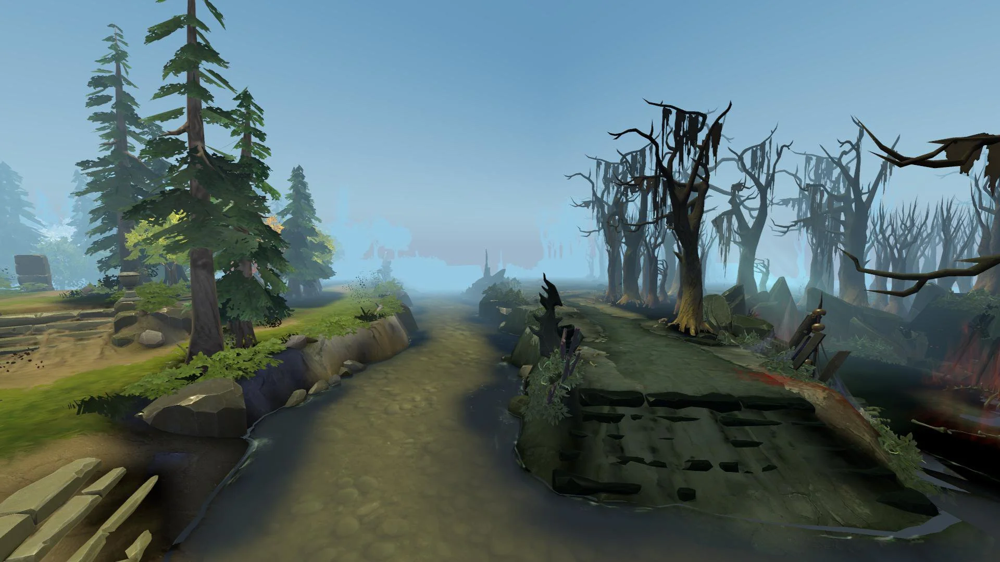

# Proposal:Infinite map generation using perlin noise

{width="600px"}

# Title and Summary

The goal of our project will be to generate infinite maps using noise functions. We will first extend what we did during the labs to make the map infinite and add some extensions to make it look more realistic.

# Goals and Deliverables

**Core**

The core of our project would be to adapt the code from the exercise on noise functions to make the map infinite and make us able to move inside it.

**Extensions**

* Add a mist which gets more and more opaque when the distance from the viewpoint increases.
{width="600px"}
* Terrain specialisation: use different noise functions based on where we are on the map to have different terrains such as desert (lower height difference), mountains (sharper peaks) and snow texture.
* Use turbulence to create water waves so that it looks more realistic.

# Schedule

* 30.04-13.05: During the first 2 weeks, we will try to implement the core of our project, i.e. the generation of infinite landscapes and the movement inside it. Therefore, we will first spend some times reading articles about it and create the structure of the project by adapting the code from the lab on noise. The second week, we will implement it by first "generating" the infinte map and then, add the possibility to move inside it with the mouse.
* 14.05-27.05: During the next 2 weeks, we will try to implement our extensions. All members will have one extension attributed to themselves (even though we will collaborate together on every extention) and we will try to work in parallel. For the mist, we will try to pass the distance betweeen the position to the camera in the shader and use decreasing opacity. For the terrains, we will use different noise functions. A first noise function to decide which terrain we will be using and then a noise function specific to each terrain with specific attributes.
* 28.05-01.06: Finally, during the last exercise session, we will prepare the video for the final presentation and finalize our code/deliverables.

# Resources

https://www.redblobgames.com/maps/terrain-from-noise/
