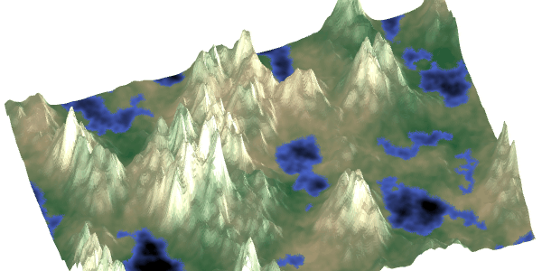
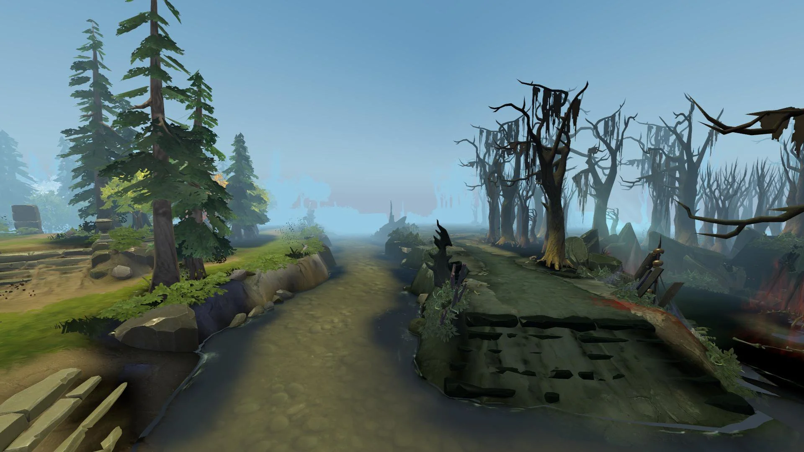
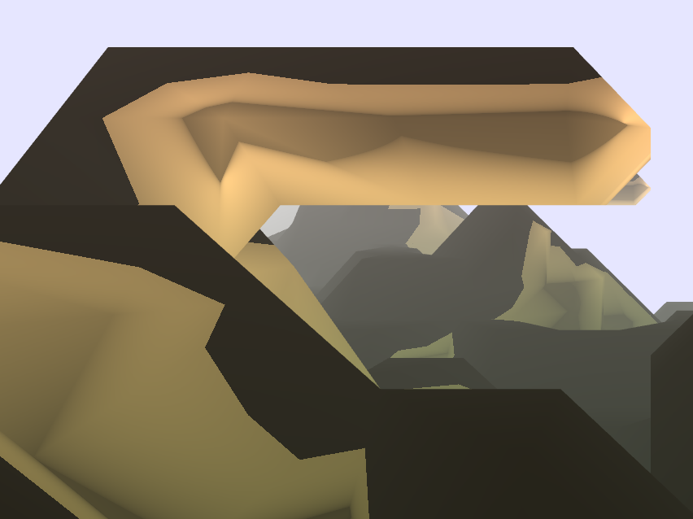
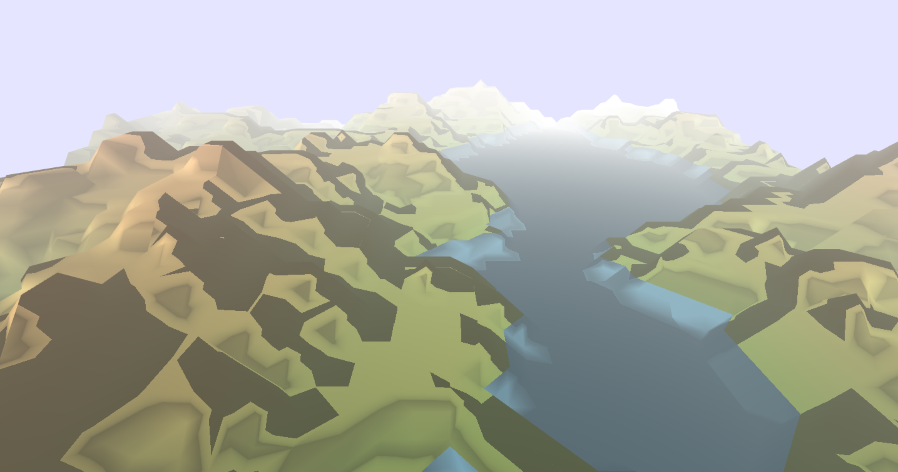

{width="600px"}

# Title and Summary

The goal of our project will be to generate infinite maps using noise functions. We will first extend what we did during the labs to make the map infinite and add some extensions to make it look more realistic.

# Goals and Deliverables

**Core**

The core of our project would be to adapt the code from the exercise on noise functions to make the map infinite and make us able to move inside it.

**Extensions**

* Add a mist which gets more and more opaque when the distance from the viewpoint increases.

{width="600px"}

* Terrain specialisation: use different noise functions based on where we are on the map to have different terrains such as desert (lower height difference), mountains (sharper peaks) and snow texture.
* Use turbulence to create water waves so that it looks more realistic.

# Schedule

* 30.04-13.05: During the first 2 weeks, we will try to implement the core of our project, i.e. the generation of infinite landscapes and the movement inside it. Therefore, we will first spend some times reading articles about it and create the structure of the project by adapting the code from the lab on noise. The second week, we will implement it by first "generating" the infinte map and then, add the possibility to move inside it with the mouse.

* 14.05-27.05: During the next 2 weeks, we will try to implement our extensions. All members will have one extension attributed to themselves (even though we will collaborate together on every extention) and we will try to work in parallel. For the mist, we will try to pass the distance betweeen the position to the camera in the shader and use decreasing opacity. For the terrains, we will use different noise functions. A first noise function to decide which terrain we will be using and then a noise function specific to each terrain with specific attributes.
* 28.05-01.06: Finally, during the last exercise session, we will prepare the video for the final presentation and finalize our code/deliverables.

# Resources

https://www.redblobgames.com/maps/terrain-from-noise/

# Milestone Report

**Summary**

During the first weeks of the project, we had some struggles knowing where to start, since we had never implemented the full pipeline in the exercices. After talking with the assistants, which told us that we could implement the algorithm on the JS side, it became a bit clearer and we were able to implement the following features:

- The generation of an infinite map. For that, we decided to use 9 chunks with a given dimension (10x10x10 for example) to generate our map. Whenever the camera is moving, we delete in memory the 3 chunks that are in the opposite direction of the camera movement and compute the 3 new chunks. Like that, we always have 9 chunks, we don't have too many computation to do and we can move to infinity in each directions.

{width="450px"}

{width="450px"}

- An easy interaction with the scene where we can move the camera in the x and y direction to see the generation of the terrain and see that it is indeed infinite.

- A first implementation of the marching cube on the JS side. For that, we iterate over all our (x,y,z) coordinates of the chunk (when we have to regenerate them), map them to some other coordinates for our perlin noise, call a 3D-perlin noise function which tell us whether the given point (which represents the corner of a cube in the algorithm) will be displayed or not.
Then, we generate half edge points which will represent the vertex of the triangles we will create for our mesh. For each cube, we then check which corners have to be displayed, transform this in binary to have an index in a lookup table taken from internet that tells us which triangles we'll have to draw. We then push our half edge points in our triangle mesh. To finish, we compute our faces normal using the cross product between 2 of our sides and normalizing it and then for each vertex, we update the vertex normal by adding the contribution of each face. We haven't implemented any smoothing strategy for the marching cube algorithm yet.

{width="600px"}

- We ported the noise functions to the JS side as well and created some easy 3D-perlin noise functions. For example, we transformed the 2D-perlin noise from the last exercise so that our pipeline can generate the same terrain but infinitely long. This is however not the most interesting terrain since it doesn't have any caves, which is one of the main reason why marching cube algorithm is interesting.

- We had a first try at creating a mist to hide the horizon, which doesn't look very good for the moment, but gave us some ideas on how to implement it more properly.

{width="600px"}

**Problems faced**

Some of the problems we faced/are currently facing are the following:

- As stated before, we had some struggles knowing how and where to start, but now we have a clearer idea on what to do.
- Due to an error on the index, we had discontinuity at the chunks boundaries. It took us some time to find where the bug was, but now it works fine.
- Our light model/normals are not totally correct for the moment and the scene doesn't look very natural.
- We have normal discontinuity on the chunks boundaries due to the method we are currently using to update the normals.
- We are thinking about a way to use different noise functions depending on where we are in our world, but we don't know yet how to ensure not to have discontinuity on the chunks boundaries with different noise functions (how to smooth the values so that it doesn't jump from +0.5 to -0.5 in two chunks next to each other).

**Refined Schedule**

* 18.05-20.05: We will first try to finish our base implementation. For that, we will work on correcting our normals and lights, try to find a way to avoid the normal discontinuity between chunks and implement a smoothing method for the marching cube. We will also try to find some more interesting 3D-noise functions.
* 21.05-27.05: We will try to implement some extensions. First the mist effect since we have some ideas on how to do it. Then, we will probably try to find a way to implement different noise functions depending on the offset of the chunks. For that, we are thinking about using a first noise function which given an offset index, returns an index for the noise function we will use. Then we use this noise function on the whole chunk to generate the map. Our main problem will be to avoid the discontinuity on the boundaries and we will have to think carefully about that. We will then try a 3rd extension depending on the time we have and the result of our previous parts.
* 28.05-01.06: Finally, during the last exercise session, we will prepare the video for the final presentation and finalize our code/deliverables.

